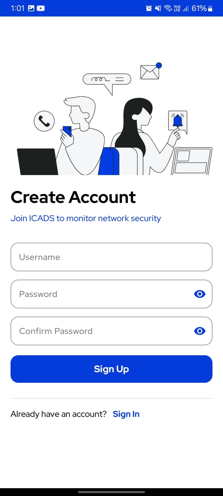

# ICADS Android App

The **ICADS Android App** is the mobile companion to the Intelligent Cyber Attacks Detection System (ICADS), designed to empower administrators with real-time alerts and system monitoring tools to defend against DDoS and other cyber threats. Built using **Java** in **Android Studio**, it connects seamlessly with Firebase for backend data, notifications, and authentication.

---

## 📱 Features

- 🔔 **Real-time Alerts** via Firebase Cloud Messaging (FCM)
- 🛡️ **Threat Detection Feed** displaying type, source IP, and timestamp
- 📊 **System Metrics Visualization** (CPU, memory usage, etc.)
- ✅ **Approve/Block Suspicious Requests** directly from the app
- 📂 **Log Viewer** with filters for alerts, timestamps, and IPs
- 🔐 **Firebase Authentication** for secure access

---

## 🧰 Tech Stack

- **Java** (Android SDK)
- **Android Studio**
- **Firebase Realtime Database**
- **Firebase Cloud Messaging (FCM)**
- **Firebase Authentication**
- **Material Design Components**

---

## 🚀 Getting Started

### Prerequisites

- Android Studio installed
- Firebase Project setup (Realtime DB + FCM + Auth)

### Installation Steps

1. **Clone the Repository**

   ```bash
   git clone https://github.com/mzainxo/ICADS-android-app.git
   cd ICADS-android-app


2. **Open in Android Studio**

3. **Add Firebase Configuration**

- Download google-services.json from your Firebase Console
- Place it in the app/ directory of the project

4. **Build and Run**
   
- Sync Gradle
- Run on a connected Android device or emulator

---

## 📸 Screenshots


### 📊 Dashboard


### 📈 Threat Graph


### 🔔 Alerts Feed


### ❓ FAQs Page


### 🔐 Login Screen


### 📝 Signup Screen


### 👤 User Profile


### 🖼️ Profile Picture Upload

